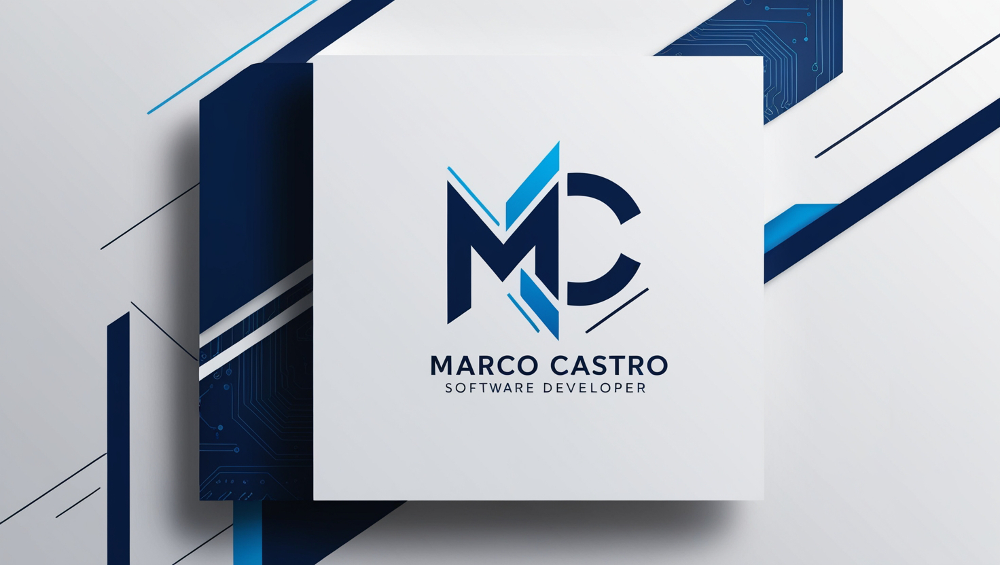

<h1 align="center">Hi 👋, I'm Marco</h1>
<h3 align="center">A passionate Software developer from Venezuela 🇻🇪</h3>

  

---

### 👨‍💻 About Me
* 🚀 I’m currently focused on **Full Stack Development**, **Cloud Architecture**, and **DevOps** practices.
* ☁️ Passionate about building and deploying scalable cloud solutions using **Azure** and **AWS**.
* 🐳 Expert in containerization with **Docker** and streamlining CI/CD workflows.
* 💬 Ask me about: **JavaScript, TypeScript, NestJS, Azure, Docker, and DevOps**.
* 📫 How to reach me: [marco.castro01@email.com](mailto:tu-email@ejemplo.com)

---

### 🌐 Socials

  
  

---

### 🛠️ Tech Stack

| Category | Skills |
| :--- | :--- |
| **Languages** |       |
| **Web Dev** |      |
| **Databases** |    |
| **DevOps & Cloud** |      |

---

### 📈 Stats & Activity

  
  

  

---

### 🏆 GitHub Trophies

  

